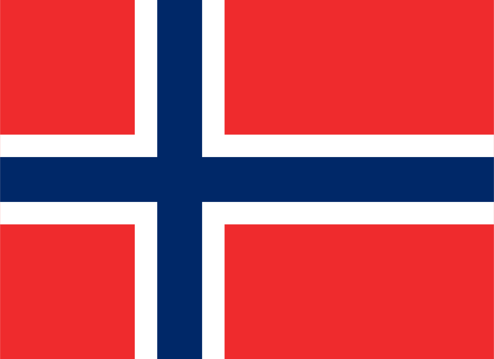
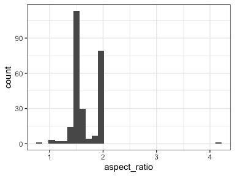

<!-- README.md is generated from README.Rmd. Please edit that file -->

# flagon

<!-- badges: start -->


<!-- badges: end -->

`flagon` provides PNG and SVG images of the flags of the world, indexed
by their [2-letter ISO-3166 country
codes](https://en.wikipedia.org/wiki/List_of_ISO_3166_country_codes).

The flags are sourced from <https://github.com/hjnilsson/country-flags>,
and are the public domain flag images from wikipedia.

All PNG flags are 1000px in width.

## Installation

You can install from [GitHub](https://github.com/coolbutuseless/flagon)
with:

``` r
# install.packages("remotes")
remotes::install_github("coolbutuseless/flagon")
```

## Usage: Retrieving filenames

``` r
library(flagon)

ccodes <- c('au', 'dk') # Australia and Germany

flagon::flags(ccodes)
#> [1] "/Library/Frameworks/R.framework/Versions/3.6/Resources/library/flagon/png/au.png"
#> [2] "/Library/Frameworks/R.framework/Versions/3.6/Resources/library/flagon/png/dk.png"
flagon::flags(ccodes, 'svg')
#> [1] "/Library/Frameworks/R.framework/Versions/3.6/Resources/library/flagon/svg/au.svg"
#> [2] "/Library/Frameworks/R.framework/Versions/3.6/Resources/library/flagon/svg/dk.svg"
```

## Using with `magick`

``` r
magick::image_read(flagon::flags('no'))
```



## That’s it

That’s all this package does.

There’s also a table of country codes (`flagon::country_codes`) along
with some image information. The first rows are shown below:

| ccode | country              | png\_width | png\_height | png\_filesize | aspect\_ratio | svg\_filesize |
| :---- | :------------------- | ---------: | ----------: | ------------: | ------------: | ------------: |
| ad    | Andorra              |       1000 |         700 |         24342 |      1.428571 |         47406 |
| ae    | United Arab Emirates |       1000 |         500 |           888 |      2.000000 |           198 |
| af    | Afghanistan          |       1000 |         667 |         32653 |      1.499250 |         33346 |
| ag    | Antigua and Barbuda  |       1000 |         667 |          9752 |      1.499250 |           555 |
| ai    | Anguilla             |       1000 |         500 |          9003 |      2.000000 |          3468 |
| al    | Albania              |       1000 |         714 |         16585 |      1.400560 |          4905 |

The aspect ratios for flags varies widely.



The two outliers are Nepal (aspect ratio = 0.82) and Qatar (aspect ratio
= 4.17)

``` r
flagon::country_codes %>% 
  filter(aspect_ratio %in% range(aspect_ratio)) %>% 
  pull(ccode) %>%
  flagon::flags() %>% 
  magick::image_read() %>% 
  magick::image_montage()
```


