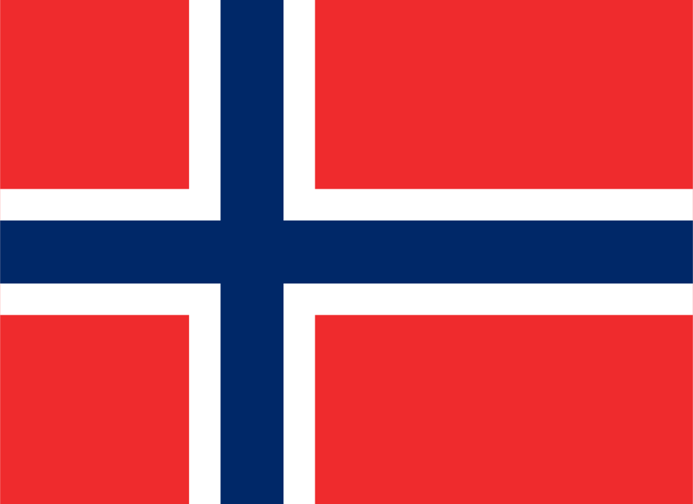

<!-- README.md is generated from README.Rmd. Please edit that file -->

# flagon

<!-- badges: start -->


<!-- badges: end -->

`flagon` provides PNG and SVG images of the flags of the world, indexed
by their [2-letter ISO-3166 country
codes](https://en.wikipedia.org/wiki/List_of_ISO_3166_country_codes).

The flags are sourced from <https://github.com/hjnilsson/country-flags>,
and are the public domain flag images from wikipedia.

## Installation

You can install from [GitHub](https://github.com/coolbutuseless/flagon)
with:

``` r
# install.packages("remotes")
remotes::install_github("coolbutuseless/flagon")
```

## Usage: Retrieving filenames

``` r
library(flagon)

country_codes <- c('au', 'dk') # Australia and Germany

flagon::flags(country_codes)
#> [1] "/Library/Frameworks/R.framework/Versions/3.6/Resources/library/flagon/png/au.png"
#> [2] "/Library/Frameworks/R.framework/Versions/3.6/Resources/library/flagon/png/dk.png"
flagon::flags(country_codes, 'svg')
#> [1] "/Library/Frameworks/R.framework/Versions/3.6/Resources/library/flagon/svg/au.svg"
#> [2] "/Library/Frameworks/R.framework/Versions/3.6/Resources/library/flagon/svg/dk.svg"
```

## Using with `magick`

``` r
magick::image_read(flagon::flags('no'))
```



## That’s it

That’s all it does.

There’s also a table of country codes (`flagon::country_codes`), the
first rows of which are shown below:

| ccode | country              |
| :---- | :------------------- |
| ad    | Andorra              |
| ae    | United Arab Emirates |
| af    | Afghanistan          |
| ag    | Antigua and Barbuda  |
| ai    | Anguilla             |
| al    | Albania              |
